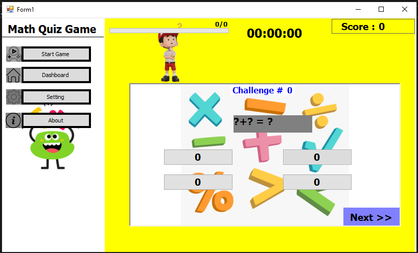
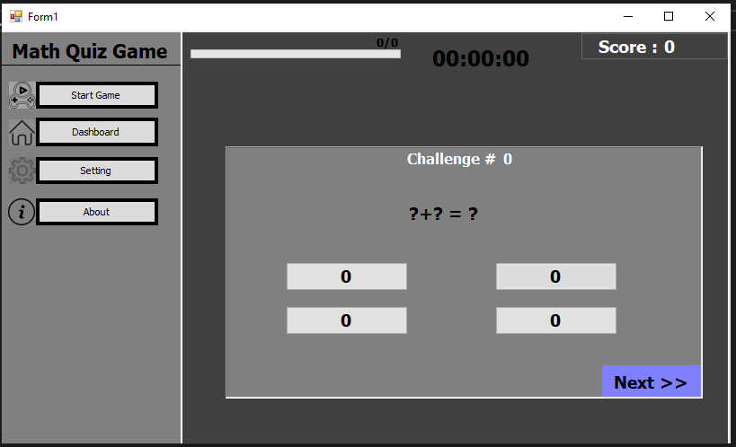

# 🧮 Math Quiz Game

> **Math Quiz Game V1.1.0** — A major C# upgrade of the original C++ version, focused on a more flexible user interface, customizable gameplay, and an enhanced user experience.

---

## 📑 Table of Contents

- [Overview](#overview)
- [Key Features](#key-features)
- [User Experience](#user-experience)
- [Technologies](#technologies)
- [Development Journey](#development-journey)

---

## 📖 Overview

**Math Quiz Game** is a desktop mathematics quiz application developed as an upgraded version of an earlier C++ implementation.

Version **V1.1.0** represents a transition from the original C++ implementation to **C# with WinForms**, with a strong focus on creating a more polished interface, flexible customization options, and an improved gameplay experience.

The project was developed as part of an educational development roadmap, applying software engineering concepts and focusing on building a flexible and customizable user interface.

---

## 📸 Screenshots

View All Screenshots

<!-- باقي الصور -->

---

## 🎯 Key Features

### 🎨 Multi-Theming

The application provides multiple interface themes designed for different audiences:

- **Formal Theme**
- **Kids Theme**

The selected theme can dynamically change the application's colors and backgrounds.

---

### ⚙️ Customizable Experience

Players can customize several aspects of the application:

- Font size:
  - Small
  - Medium
  - Large
- Music control
- Interactive sound effects control

These settings allow the user to adjust the experience according to their preferences.

---

### 🎮 Advanced Game Settings

The game provides configurable gameplay options, including:

- Difficulty level
- Mathematical operation type
- Time limit
- **Endless Mode** for questions without a predefined ending

---

### 🧩 Difficulty Levels

Players can select the desired difficulty level before starting the game, allowing the gameplay experience to be adjusted according to the selected challenge.

---

### ♾️ Endless Mode

The application includes an **Endless Mode**, allowing the player to continue answering questions without a predefined question limit.

---

### 🖥️ Modern User Interface

The interface was designed around a comfortable **Navy Blue** visual style, with an organized distribution of interface elements to provide a clear and easy-to-use experience.

---

### 📊 Interactive Results

The application provides dynamic final result screens based on the player's outcome.

The result screens display statistics including:

- Correct answers
- Incorrect answers

Different final screens are presented depending on whether the player wins or loses.

---

## 🎨 User Experience

The V1.1.0 update places particular emphasis on flexibility and customization.

The application combines:

- Dynamic themes
- Customizable font sizes
- Music and sound controls
- Configurable difficulty
- Mathematical operation selection
- Time settings
- Endless gameplay
- Dynamic result screens

These features were introduced as part of the effort to make the application feel more complete and provide a more flexible interaction experience.

---

## 🛠️ Technologies

| Technology | Usage |
|---|---|
| **C#** | Application development |
| **.NET / WinForms** | Desktop application and user interface |
| **OOP Principles** | Application design |

---

## 🏗️ Development Journey

The current version, **V1.1.0**, is an evolution of the original **V1.0.0**.

### V1.0.0

The original version was previously developed using **C++** as part of the educational development roadmap with **Dr. Mohammed Abu Hadhoud**.

### V1.1.0

The project was subsequently upgraded to:

- **C#**
- **.NET WinForms**
- A more flexible user interface
- Multi-theming
- Advanced game settings
- Customizable gameplay experience
- Interactive result screens

The main goal of this transition was to apply software engineering concepts learned during the development process while building a more flexible and customizable user interface.

---

## 📌 Version

**Current Version:** `V1.1.0`

**Previous Version:** `V1.0.0`

---

## 👨‍💻 Project Focus

The development of **Math Quiz Game V1.1.0** focuses on applying software engineering concepts while improving the application's interface, customization capabilities, and overall user experience.

---
